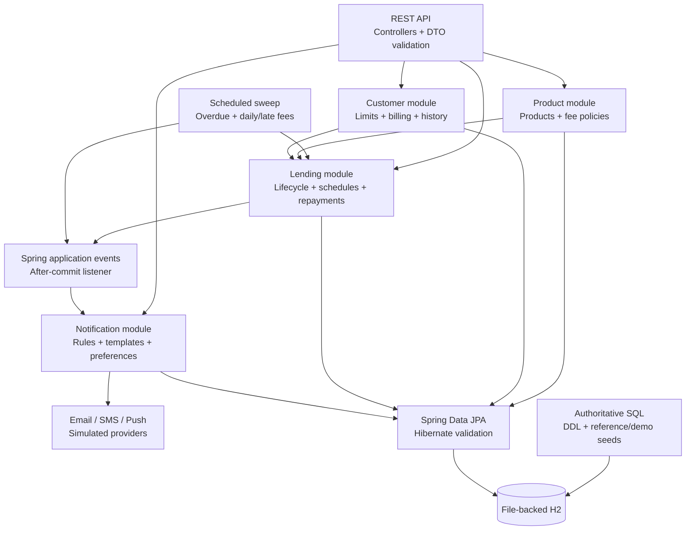
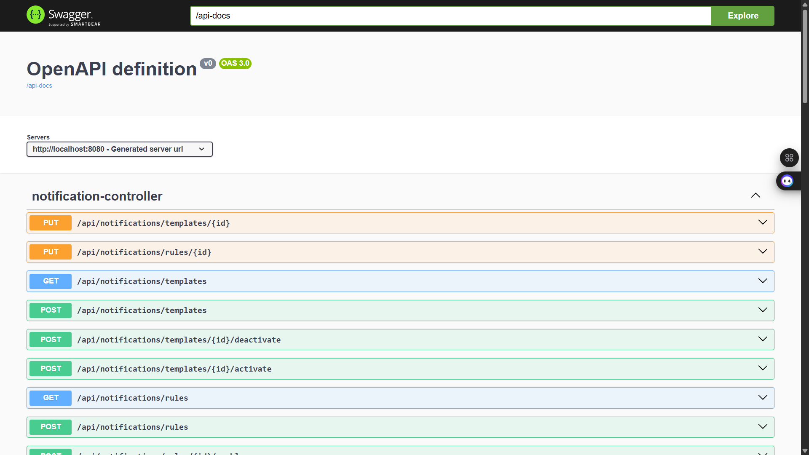
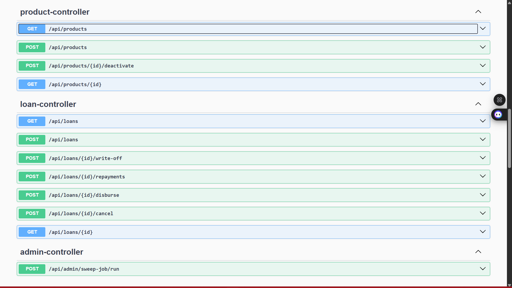
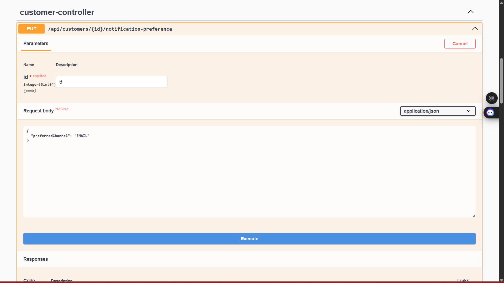
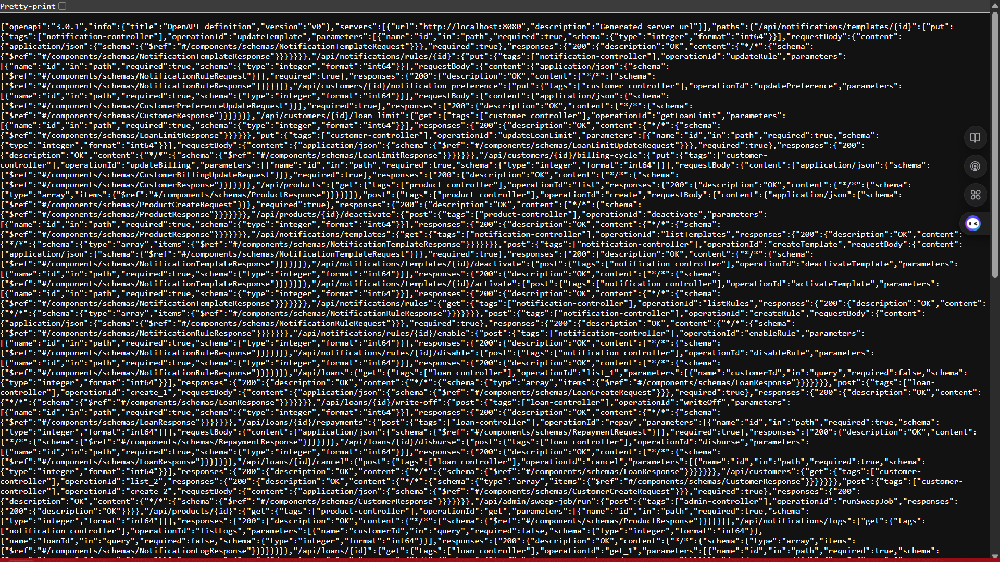

# 💳 Lending Application: Configurable Loan Management Case Study

**Lending Application** is a production-grade Spring Boot case-study solution designed to bridge the gap between configurable lending requirements and a portable, testable implementation that another engineer can clone, run, inspect, and defend in an interview.

---

## 🎯 Project Goal

The case study asks for a lending platform that can configure products, originate and disburse loans, support lump-sum and installment repayment, manage customer exposure, apply fees over time, process overdue accounts, and notify customers through multiple channels. The solution keeps those capabilities in one deployable application for assessment simplicity, while preserving explicit domain boundaries and transaction/event seams that could support later service extraction.

---

## 🧬 System Architecture

The application is a domain-organized modular/layered monolith rather than multiple independently deployed microservices. That is an intentional scope decision: the assignment can be run without a broker, service discovery, distributed tracing, or several databases, while the Product, Customer, Lending, and Notification boundaries remain visible and independently testable.



### Runtime flow

1. **HTTP/API layer** validates request structure and exposes DTO-based contracts.
2. **Domain services** enforce lending rules, transaction boundaries, state transitions, and fee allocation.
3. **Loan lifecycle** creates `PENDING` loans, explicitly disburses them to `OPEN`, and supports cancellation, repayment, overdue processing, closure, and write-off.
4. **Scheduled processing** finds eligible `OPEN`/`OVERDUE` loans and applies recoverable, idempotent charges.
5. **Notification events** are published by successful lending operations and handled after commit so notification failures cannot roll back financial changes.
6. **Persistence** uses explicit SQL to create/seed H2 and Hibernate validation to confirm ORM alignment.

---

## 🛠️ Technical Stack

| Layer | Tool | Version |
|---|---|---|
| Language | Java | 17 |
| Application framework | Spring Boot | 3.3.4 |
| Web/API | Spring Web + Bean Validation | Spring Boot managed |
| Persistence | Spring Data JPA + Hibernate | Spring Boot managed |
| Database | H2, file-backed | Spring Boot managed |
| API documentation | Springdoc OpenAPI / Swagger UI | 2.6.0 |
| Build | Maven Wrapper / Maven | 3.9.16 / 3.9+ |
| Testing | JUnit 5, Mockito, Spring MockMvc | Spring Boot managed |
| Schema ownership | SQL DDL and seed scripts | Repository-managed |

---

## 📊 Performance & Results

- **71 automated tests** pass after the final validation change, covering services, controllers, scheduler behavior, notification events/providers, transaction boundaries, seed behavior, and optimistic locking.
- **Fresh startup verified** from the checked-in SQL DDL and reference/demo seed scripts with Hibernate set to `ddl-auto=validate`.
- **Restart behavior verified** against the persistent H2 database; balances, versions, notification state, and user-edited configuration are preserved.
- **Runtime surface verified** through representative HTTP flows, Swagger UI at `/swagger-ui.html`, and OpenAPI JSON at `/api-docs`.
- **Financial arithmetic** uses `BigDecimal`; scheduled charges use stable deduplication keys; monthly installment dates use calendar-month progression.

---

## 📸 API Documentation

The complete contract is available through Swagger UI after startup:

- Swagger UI: `http://localhost:8080/swagger-ui.html`
- OpenAPI JSON: `http://localhost:8080/api-docs`
- H2 console: `http://localhost:8080/h2-console` (local development only)

The seeded reference data uses products `1`-`3` and customers `1`-`3` on a fresh database. IDs may differ for records created during local exploration.

### Swagger UI and OpenAPI reference



*Swagger UI loaded from the local application against the `/api-docs` definition, with notification-controller operations visible.*



*Product configuration and loan lifecycle operations exposed through the REST contract, including creation, disbursement, repayment, cancellation, and write-off.*



*Interactive DTO-backed request form for updating a customer's preferred notification channel.*



*Raw OpenAPI 3.0 JSON returned by `/api-docs`, suitable for tooling, client generation, and contract inspection.*

### Create a product with an installment schedule

```bash
curl -X POST http://localhost:8080/api/products \
  -H "Content-Type: application/json" \
  -d '{
    "code": "INSTALLMENT-12M",
    "name": "Twelve Month Installment Loan",
    "description": "Calendar-month repayment schedule",
    "tenureType": "MONTHS",
    "minTenureValue": 6,
    "maxTenureValue": 12,
    "interestRate": 0,
    "loanStructureType": "INSTALLMENTS",
    "installmentCount": 12,
    "billingCycleType": "INDIVIDUAL_DUE_DATE",
    "fees": [
      {
        "feeCategory": "SERVICE_FEE",
        "calculationType": "PERCENTAGE",
        "amount": 1.5,
        "daysAfterDue": null,
        "applicationTiming": "POST_DISBURSEMENT"
      }
    ]
  }'
```

An `INSTALLMENTS` product must provide a positive `installmentCount`; invalid configuration is rejected instead of silently becoming a one-installment loan.

### Configure consolidated billing

```bash
curl -X PUT http://localhost:8080/api/customers/2/billing-cycle \
  -H "Content-Type: application/json" \
  -d '{
    "billingCycleType": "CONSOLIDATED",
    "billingDay": 25
  }'
```

When the billing day does not exist in a month, the implementation clamps it to the final valid day of that month.

### Create and disburse a loan

```bash
curl -X POST http://localhost:8080/api/loans \
  -H "Content-Type: application/json" \
  -d '{
    "customerId": 1,
    "productId": 2,
    "principalAmount": 24000,
    "tenureValue": 6
  }'

curl -X POST http://localhost:8080/api/loans/<loanId>/disburse
```

The first request creates `PENDING`; the second reserves customer exposure, applies post-disbursement behavior, publishes `LOAN_DISBURSED`, and transitions the loan to `OPEN`.

### Record a repayment

```bash
curl -X POST http://localhost:8080/api/loans/<loanId>/repayments \
  -H "Content-Type: application/json" \
  -d '{
    "amount": 5000,
    "reference": "BANK-TRANSFER-0001"
  }'
```

Repayments allocate against outstanding fees before principal and reject overpayment or repayment against a non-disbursed loan.

### Run the overdue sweep

```bash
curl -X POST http://localhost:8080/api/admin/sweep-job/run
```

The sweep detects overdue installments, applies eligible daily/late charges, avoids duplicate logical charges, and publishes reminder/overdue events.

### Maintain notification configuration

```bash
curl -X POST http://localhost:8080/api/notifications/rules/<ruleId>/disable
curl -X POST http://localhost:8080/api/notifications/templates/<templateId>/deactivate
curl http://localhost:8080/api/notifications/logs?customerId=2
```

HTTP error contracts are consistent: `400` validation/malformed requests, `404` missing resources, `409` configuration or optimistic-lock conflicts, and `422` business-rule violations.

---

## 📋 Case Study Coverage

| Requirement | Implementation | Decision and evidence |
|---|---|---|
| Spring Boot | Spring Boot 3.3.4 Maven application | Keeps the submission portable and directly runnable from IntelliJ or the Maven Wrapper. |
| Microservices suitability | Domain-organized modular monolith | Literal multi-service deployment would add distributed complexity disproportionate to this standalone assessment. Product, Customer, Lending, and Notification seams remain extraction-ready. |
| Autonomous database setup | SQL DDL + seed initialization | Spring executes the checked-in create/reference/demo scripts; Hibernate validates mappings rather than mutating schema. |
| Product configuration | Product REST API | Supports DAYS/MONTHS tenure, lump-sum/installment structure, and active fee policies. |
| Service fees | Fixed/percentage with timing | `ORIGINATION` and `POST_DISBURSEMENT` are explicit and idempotent. |
| Daily and late fees | Scheduled sweep | Late tiers apply once thresholds are reached, including after a missed trigger day. Stable charge keys prevent duplication. |
| Lump-sum and installment loans | Loan schedule generation | Installment count is required for installment products; monthly schedules use calendar arithmetic and preserve rounding remainder. |
| Consolidated billing | Customer-owned billing cycle | Customers choose individual dates or a billing day; callers do not invent grouping IDs. Month-end dates are deterministic. |
| Loan lifecycle | Explicit state transitions | `PENDING`, `OPEN`, `CLOSED`, `CANCELLED`, `OVERDUE`, and `WRITTEN_OFF` are enforced by domain operations. |
| Customer profile/history | Customer API and read model | Financial history derives from persisted loans, repayments, exposure, and limit data rather than an invented credit score. |
| Customer exposure limits | Optimistic locking | `LoanLimit.version` rejects stale concurrent reservations instead of silently overwriting them. |
| Notifications | Spring events + providers | After-commit listener resolves rules/templates/preferences and delegates to simulated Email/SMS/Push providers. |
| Testing | Layered automated suite | Service, scheduler, MockMvc, event/listener, transaction, seed, and concurrency tests cover the high-risk behavior. |
| Documentation | README + project summary | This README maps requirements to implementation decisions and provides concrete execution examples. |

### Deliberate scope boundaries

- This is not presented as multiple deployable microservices.
- Notification providers simulate delivery and do not call external vendors.
- Kafka/RabbitMQ is not required for the in-process event boundary.
- H2 is used for a zero-setup assessment environment; PostgreSQL and versioned Flyway/Liquibase migrations would be appropriate for production evolution.
- `interestRate` is retained as product metadata; interest accrual/amortization is outside the case-study scope because its calculation model was not specified.
- Authentication and authorization are outside the assignment scope.

---

## 🧠 Key Design Decisions

- **Modular monolith over premature microservices:** one deployable unit keeps local setup and testing reliable while package/service boundaries preserve a credible extraction path.
- **SQL owns the schema:** explicit DDL and seed scripts are inspectable deliverables; Hibernate `validate` catches ORM drift without silently changing tables.
- **File-backed H2 for portability:** evaluators can run the system without provisioning PostgreSQL, while persistence across restarts still demonstrates realistic stateful behavior.
- **Pending then disbursement:** separating creation from disbursement makes cancellation-before-disbursement, limit reservation, fee timing, and notification timing explicit.
- **Customer-level consolidated billing:** billing configuration belongs to the customer because the requirement is a shared due-date policy across that customer's loans.
- **Calendar-month installment arithmetic:** monthly products follow calendar progression rather than approximating every month as a fixed number of days.
- **Threshold recovery plus idempotency:** `daysPastDue >= threshold` recovers from missed scheduler runs; stable charge identities ensure retries do not duplicate money movements.
- **After-commit notification processing:** lending transactions remain authoritative; notification persistence or provider failures cannot undo a successful disbursement or repayment.
- **Simulated channel providers:** provider interfaces demonstrate extensibility without introducing credentials, external services, or integration noise into the case study.
- **Optimistic locking for lending limits:** the high-value concurrency risk is protected at the persistence boundary without introducing distributed locks.
- **Explicit configuration conflicts:** ambiguous notification rules/templates return `409` instead of relying on database ordering or silently changing another administrator's configuration.
- **KISS/DRY hardening:** shared domain operations centralize charge attribution and installment settlement, while readable private methods avoid speculative abstraction layers.

---

## 📂 Project Structure

```text
lending-app/
├── assets/                             # README API documentation screenshots
│   ├── openapi-contract.png            # Machine-readable OpenAPI JSON view
│   ├── swagger-customer-notifications.png # Customer notification preference view
│   ├── swagger-overview.png            # Swagger UI reference view
│   └── swagger-product-loan.png        # Product and loan lifecycle views
├── .mvn/wrapper/                       # Maven Wrapper configuration
├── mvnw                                # Unix/macOS Maven Wrapper entry point
├── mvnw.cmd                            # Windows Maven Wrapper entry point
├── pom.xml                             # Spring Boot and dependency configuration
├── readme.md                           # Public setup, architecture, and requirements guide
├── projectsummary.md                   # Personal implementation notes (gitignored)
├── src/
│   ├── main/
│   │   ├── java/com/example/lending/
│   │   │   ├── config/                 # Typed application configuration
│   │   │   ├── controller/             # REST endpoints
│   │   │   ├── domain/                 # Product, customer, loan, notification entities
│   │   │   ├── dto/                    # Request/response contracts
│   │   │   ├── event/                  # Lending notification events/listener
│   │   │   ├── exception/              # Stable API error mapping
│   │   │   ├── notification/           # Email/SMS/Push provider seam
│   │   │   ├── repository/             # Spring Data persistence boundaries
│   │   │   ├── scheduler/              # Overdue sweep and scheduling
│   │   │   └── service/                # Business operations and fee allocation
│   │   └── resources/
│   │       ├── application.yml         # Runtime configuration
│   │       └── database/
│   │           ├── ddl/create/         # Authoritative schema creation
│   │           ├── ddl/recreate/       # Explicit destructive reset script
│   │           └── seed/               # Reference and demo data
│   └── test/java/com/example/lending/  # Unit, web, scheduler, JPA, and transaction tests
└── .gitignore                          # Excludes IDE, build, H2, temp, and personal files
```

Generated `target/`, local H2 `data/`, rendered `tmp/`, IntelliJ metadata, and the local assignment PDF are intentionally excluded from Git through `.gitignore`.

---

## ⚙️ Installation & Setup

### Prerequisites

- JDK 17
- No external database, broker, or notification provider
- Internet access on the first Maven Wrapper run so Maven can be downloaded if it is not cached locally

### Run from IntelliJ IDEA

1. Open the repository root, not `src`.
2. Import `pom.xml` as a Maven project.
3. Select JDK 17 as the Project SDK and Maven JVM.
4. Open `src/main/java/com/example/lending/LendingApplication.java`.
5. Run `LendingApplication` from the green run icon.
6. Open Swagger UI at `http://localhost:8080/swagger-ui.html`.

### Run from the terminal

Windows:

```powershell
.\mvnw.cmd clean verify
.\mvnw.cmd spring-boot:run
```

Unix/macOS:

```bash
./mvnw clean verify
./mvnw spring-boot:run
```

The application uses the default profile and listens on port `8080`.

### Database lifecycle

Normal startup runs:

```text
database/ddl/create/001_create_schema.sql
        ↓
database/seed/001_reference_data.sql
        ↓
database/seed/002_demo_data.sql
        ↓
Hibernate ddl-auto=validate
        ↓
Spring Boot application
```

The H2 database is stored at `./data/lendingdb`. Seed statements insert missing IDs without overwriting balances, versions, template edits, or rule state. To intentionally reset local data, stop the application and either remove `data/lendingdb.mv.db` or execute the explicit recreate, create, and seed scripts in that order.

### Useful URLs

| Resource | URL |
|---|---|
| Swagger UI | `http://localhost:8080/swagger-ui.html` |
| OpenAPI JSON | `http://localhost:8080/api-docs` |
| H2 Console | `http://localhost:8080/h2-console` |
| H2 JDBC URL | `jdbc:h2:file:./data/lendingdb` |

The H2 console and unauthenticated APIs are for local development/demo use only.

---

## 🔍 Domain Detail and Verification

### Loan lifecycle

```text
create → PENDING → disburse → OPEN
                         ├── repay → OPEN/CLOSED
                         ├── sweep → OVERDUE
                         ├── cancel → CANCELLED
                         └── write-off → WRITTEN_OFF
```

The compatibility create-and-disburse path delegates through the same canonical lifecycle, so limit reservation, fee timing, state guards, and events cannot drift between entry points.

### Fee and repayment model

- Product `Fee` records are configuration.
- Applied `LoanCharge` records are immutable financial events with stable deduplication keys.
- Service fees can apply at origination or post-disbursement.
- Late-fee tiers are independently eligible once their thresholds are reached.
- Repayments allocate fees first, then principal, with `BigDecimal` arithmetic and explicit rounding.
- Installment-associated charges update both installment and aggregate loan balances through shared domain operations.

### Notification model

```text
successful lending transaction
        ↓
Spring application event
        ↓
after-commit listener
        ↓
rule + template + preference resolution
        ↓
simulated channel provider
        ↓
SENT / SKIPPED / FAILED audit log
```

Notification rule scopes are deterministic: product plus segment is more specific than product-only, segment-only, or generic; equivalent enabled scopes are rejected. At most one template may be active for an event/channel pair, and replacement requires an explicit deactivate-then-activate transition.

### Verification command

```bash
./mvnw clean verify
```

The final verification baseline is **71 tests, 0 failures, 0 errors, and 0 skips**.

---

## 🎓 Skills Demonstrated

- **Java/Spring Boot:** built a complete REST application with dependency injection, validation, transactions, scheduled work, events, and centralized error handling.
- **Domain modelling:** represented products, fees, customers, limits, loans, installments, repayments, charges, notification rules, templates, and audit logs with explicit invariants.
- **Relational persistence:** designed SQL-owned DDL and seed data, aligned JPA mappings, and used optimistic locking for concurrent exposure updates.
- **REST API design:** exposed DTO-based endpoints with predictable success, validation, not-found, conflict, and business-rule responses.
- **Financial correctness:** used `BigDecimal`, fee-first allocation, calendar-aware schedules, stable charge identities, and installment settlement rules.
- **Event-driven design:** decoupled secondary notification processing from committed lending operations using Spring application events and an after-commit listener.
- **Testing strategy:** combined focused unit/service tests with MockMvc, scheduler, transaction, provider, seed-repeatability, and optimistic-lock verification.
- **Engineering judgement:** kept the assignment portable and explainable while documenting the production evolution path for PostgreSQL, migrations, brokers, real providers, and authentication.

---
